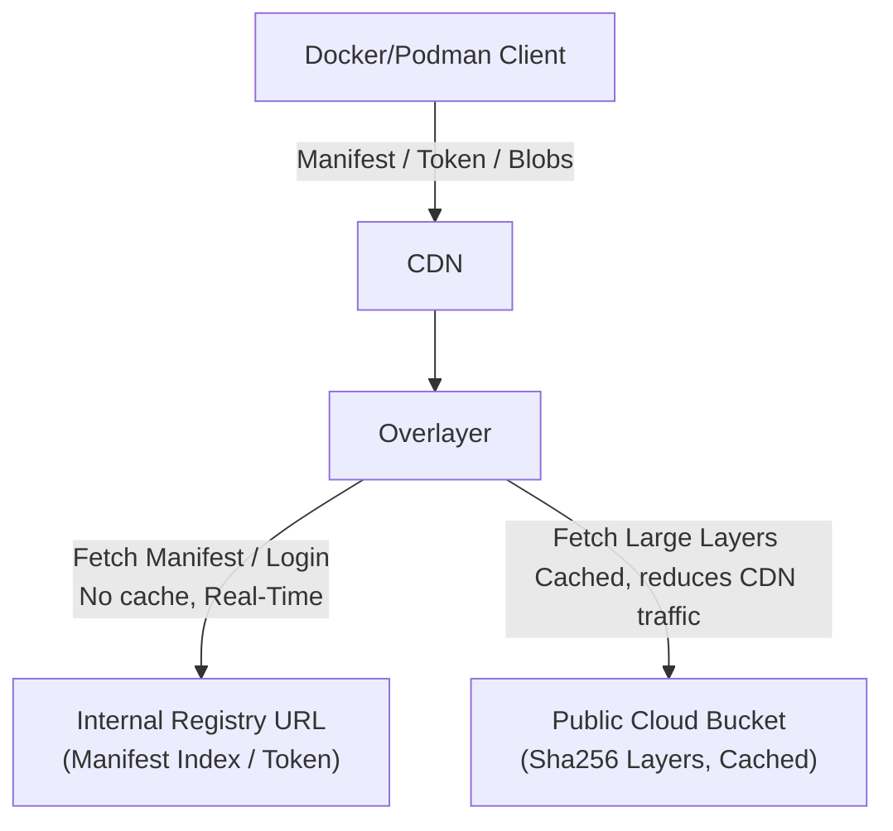

# Overlayer

[](https://github.com/STARRY-S/overlayer/actions/workflows/ci.yaml)
[](https://github.com/STARRY-S/overlayer/releases)
[](https://goreportcard.com/report/github.com/STARRY-S/overlayer)
[](https://opensource.org/licenses/Apache-2.0)

Overlayer is a reverse proxy designed to reduce CDN traffic costs and provide security layer for registry servers.



## Usage

```sh
git clone https://github.com/STARRY-S/overlayer.git && cd overlayer
cp config.example.yaml config.yaml
# Edit configuration
vim config.yaml

# Optional: create CDN Auth Secret
echo "TokenValueFooBar" > token
podman secret create CDN_AUTH_TOKEN token

# Run in container
VERSION="latest"
podman run -dit \
    -v $(pwd)/config.yaml:/config.yaml \
    -v $(pwd)/certs:/certs \
    --name overlayer \
    --network host \
    --restart=always \
    --secret CDN_AUTH_TOKEN,type=env,target=BLOBS_CDN_AUTH_TOKEN \
    ghcr.io/starry-s/overlayer:${VERSION} run -c=/config.yaml
```

## License

Copyright 2026 STARRY-S

Licensed under the Apache License, Version 2.0 (the "License");
you may not use this file except in compliance with the License.
You may obtain a copy of the License at

http://www.apache.org/licenses/LICENSE-2.0

Unless required by applicable law or agreed to in writing, software
distributed under the License is distributed on an "AS IS" BASIS,
WITHOUT WARRANTIES OR CONDITIONS OF ANY KIND, either express or implied.
See the License for the specific language governing permissions and
limitations under the License.
